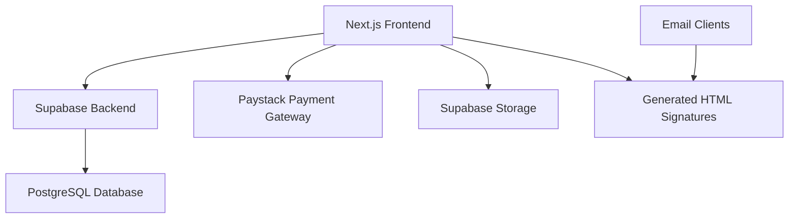

# SignatureCraft Design Document

## Overview

SignatureCraft is a modern SaaS platform built with Next.js 15, React 19, and ShadCN UI components. The application follows a component-driven architecture with server-side rendering, real-time signature preview, and seamless integration with Supabase for backend services and Paystack for payments. The design emphasizes user experience, performance, and scalability while maintaining a clean, professional interface.

## Architecture

### High-Level Architecture



### Technology Stack

- **Frontend Framework**: Next.js 15.4.1 with App Router
- **UI Framework**: React 19.1.0 with TypeScript
- **Styling**: Tailwind CSS v4 with ShadCN UI components
- **Backend**: Supabase (PostgreSQL, Authentication, Storage)
- **ORM**: Drizzle for type-safe database operations
- **Rich Text Editor**: TipTap with Notion-style blocks
- **Payment Processing**: Paystack for ZAR billing
- **Email Service**: Resend for email delivery
- **Email Templates**: React Email v4.2.3 with @react-email/components v0.3.1
- **Email Development**: Local React Email preview server on port 3001
- **Deployment**: Vercel with Turbopack optimization
- **Package Manager**: pnpm

### Application Structure

```
signature-craft/
├── emails/                       # React Email templates (root level)
│   ├── welcome.tsx               # Welcome email template (implemented)
│   ├── password-reset.tsx        # Password reset template (implemented)
│   ├── team-invitation.tsx       # Team invitation template (implemented)
│   ├── subscription-update.tsx   # Subscription notifications (implemented)
│   └── components/               # Shared email components
│       └── EmailLayout.tsx       # Common email layout with branding (implemented)
├── src/
│   ├── app/                      # Next.js App Router
│   │   ├── (auth)/               # Authentication routes
│   │   │   ├── login/
│   │   │   ├── register/
│   │   │   └── reset-password/
│   │   ├── (dashboard)/          # Protected dashboard routes
│   │   │   ├── builder/          # Signature builder
│   │   │   ├── signatures/       # Signature management
│   │   │   ├── team/             # Team management
│   │   │   └── settings/         # User settings
│   │   ├── api/                  # API routes
│   │   │   ├── auth/
│   │   │   ├── signatures/
│   │   │   ├── payments/
│   │   │   └── webhooks/
│   │   ├── globals.css
│   │   ├── layout.tsx
│   │   └── page.tsx
│   ├── components/               # Reusable UI components
│   │   ├── ui/                   # ShadCN UI components
│   │   ├── signature/            # Signature-specific components
│   │   ├── forms/                # Form components
│   │   └── layout/               # Layout components
│   ├── lib/                      # Utility functions and configurations
│   │   ├── auth.ts               # Authentication utilities
│   │   ├── db.ts                 # Database configuration
│   │   ├── payments.ts           # Paystack integration
│   │   ├── storage.ts            # File storage utilities
│   │   ├── email.ts              # Resend email configuration
│   │   └── utils.ts              # General utilities
│   ├── types/                    # TypeScript type definitions
│   └── hooks/                    # Custom React hooks
├── .env.example                  # Environment variables template (implemented)
├── package.json                  # Dependencies with React Email setup (implemented)
├── tsconfig.json                 # TypeScript config with email path alias (implemented)
└── README.md                     # Project documentation (implemented)
```

## Components and Interfaces

### Core Components

#### 1. Signature Builder (`/components/signature/SignatureBuilder.tsx`)
- **Purpose**: Main signature creation interface with drag-and-drop functionality
- **Key Features**:
  - Real-time preview with live updates
  - Element manipulation (text, images, social links)
  - ShadCN form components for input handling
  - Responsive design for mobile and desktop

#### 2. Signature Preview (`/components/signature/SignaturePreview.tsx`)
- **Purpose**: Live preview of signature as HTML
- **Key Features**:
  - Real-time rendering of signature elements
  - Cross-client compatibility preview
  - Export-ready HTML generation

#### 3. Element Panels (`/components/signature/ElementPanels/`)
- **TextPanel**: Font, color, and formatting controls using ShadCN Select and ColorPicker
- **ImagePanel**: Logo/avatar upload with ShadCN Dialog and file input
- **SocialPanel**: Social media link management with icon selection
- **BannerPanel**: Banner image upload and positioning

#### 4. Authentication Components (`/components/auth/`)
- **LoginForm**: ShadCN form with validation
- **RegisterForm**: Multi-step registration with email verification
- **PasswordReset**: Secure password reset flow

#### 5. Payment Components (`/components/payments/`)
- **SubscriptionPlans**: Pricing display with ShadCN Cards
- **PaystackCheckout**: Integrated Paystack payment flow
- **BillingHistory**: Transaction history and invoice management

#### 6. Email Templates (`/emails/`)
- **WelcomeEmail**: Branded welcome email with email verification button
- **PasswordResetEmail**: Secure password reset with token-based authentication
- **TeamInvitationEmail**: Team invitation with accept invitation button
- **SubscriptionUpdateEmail**: Subscription confirmation with plan details
- **EmailLayout**: Shared layout component with header, footer and consistent styling

### Database Schema (Supabase/PostgreSQL)

```sql
-- Users table (extends Supabase auth.users)
CREATE TABLE profiles (
  id UUID REFERENCES auth.users PRIMARY KEY,
  email TEXT UNIQUE NOT NULL,
  full_name TEXT,
  avatar_url TEXT,
  subscription_tier TEXT DEFAULT 'free',
  subscription_status TEXT DEFAULT 'active',
  created_at TIMESTAMP WITH TIME ZONE DEFAULT NOW(),
  updated_at TIMESTAMP WITH TIME ZONE DEFAULT NOW()
);

-- Signatures table
CREATE TABLE signatures (
  id UUID PRIMARY KEY DEFAULT gen_random_uuid(),
  user_id UUID REFERENCES profiles(id) ON DELETE CASCADE,
  name TEXT NOT NULL,
  html_content TEXT NOT NULL,
  json_data JSONB NOT NULL,
  is_active BOOLEAN DEFAULT false,
  created_at TIMESTAMP WITH TIME ZONE DEFAULT NOW(),
  updated_at TIMESTAMP WITH TIME ZONE DEFAULT NOW()
);

-- Teams table
CREATE TABLE teams (
  id UUID PRIMARY KEY DEFAULT gen_random_uuid(),
  name TEXT NOT NULL,
  owner_id UUID REFERENCES profiles(id) ON DELETE CASCADE,
  subscription_tier TEXT DEFAULT 'team',
  created_at TIMESTAMP WITH TIME ZONE DEFAULT NOW()
);

-- Team members table
CREATE TABLE team_members (
  id UUID PRIMARY KEY DEFAULT gen_random_uuid(),
  team_id UUID REFERENCES teams(id) ON DELETE CASCADE,
  user_id UUID REFERENCES profiles(id) ON DELETE CASCADE,
  role TEXT DEFAULT 'member',
  joined_at TIMESTAMP WITH TIME ZONE DEFAULT NOW(),
  UNIQUE(team_id, user_id)
);

-- Signature templates table
CREATE TABLE signature_templates (
  id UUID PRIMARY KEY DEFAULT gen_random_uuid(),
  team_id UUID REFERENCES teams(id) ON DELETE CASCADE,
  name TEXT NOT NULL,
  html_content TEXT NOT NULL,
  json_data JSONB NOT NULL,
  is_default BOOLEAN DEFAULT false,
  created_at TIMESTAMP WITH TIME ZONE DEFAULT NOW()
);

-- Subscriptions table
CREATE TABLE subscriptions (
  id UUID PRIMARY KEY DEFAULT gen_random_uuid(),
  user_id UUID REFERENCES profiles(id) ON DELETE CASCADE,
  paystack_subscription_code TEXT UNIQUE,
  plan_code TEXT NOT NULL,
  status TEXT NOT NULL,
  amount INTEGER NOT NULL,
  currency TEXT DEFAULT 'ZAR',
  next_payment_date TIMESTAMP WITH TIME ZONE,
  created_at TIMESTAMP WITH TIME ZONE DEFAULT NOW(),
  updated_at TIMESTAMP WITH TIME ZONE DEFAULT NOW()
);
```

### API Interfaces

#### Authentication API (`/app/api/auth/`)
```typescript
// POST /api/auth/register
interface RegisterRequest {
  email: string;
  password: string;
  fullName: string;
}

// POST /api/auth/login
interface LoginRequest {
  email: string;
  password: string;
}
```

#### Signatures API (`/app/api/signatures/`)
```typescript
// GET /api/signatures
interface SignatureListResponse {
  signatures: Signature[];
  total: number;
}

// POST /api/signatures
interface CreateSignatureRequest {
  name: string;
  htmlContent: string;
  jsonData: SignatureData;
}

// PUT /api/signatures/[id]
interface UpdateSignatureRequest {
  name?: string;
  htmlContent?: string;
  jsonData?: SignatureData;
  isActive?: boolean;
}
```

#### Payments API (`/app/api/payments/`)
```typescript
// POST /api/payments/initialize
interface PaymentInitializeRequest {
  planCode: string;
  email: string;
}

// POST /api/webhooks/paystack
interface PaystackWebhookEvent {
  event: string;
  data: {
    subscription_code: string;
    status: string;
    amount: number;
    customer: {
      email: string;
    };
  };
}
```

#### Email API (`/app/api/email/`)
```typescript
// POST /api/email/send
interface SendEmailRequest {
  to: string;
  template: 'welcome' | 'password-reset' | 'team-invitation' | 'subscription-update';
  data: Record<string, any>;
}

// Email template props interfaces
interface WelcomeEmailProps {
  name: string;
  verificationUrl: string;
}

interface PasswordResetEmailProps {
  name: string;
  resetUrl: string;
}

interface TeamInvitationEmailProps {
  inviteeEmail: string;
  teamName: string;
  inviterName: string;
  invitationUrl: string;
}

interface SubscriptionUpdateEmailProps {
  name: string;
  planName: string;
  planPrice: string;
  billingDate: string;
  accountUrl: string;
}

// Email service configuration
interface EmailConfig {
  resendApiKey: string;
  fromEmail: string;
  fromName: string;
}
```

## Data Models

### Signature Data Model
```typescript
interface SignatureData {
  personalInfo: {
    name: string;
    title: string;
    company: string;
    email: string;
    phone: string;
    website: string;
  };
  styling: {
    fontFamily: string;
    fontSize: number;
    primaryColor: string;
    secondaryColor: string;
    layout: 'horizontal' | 'vertical';
  };
  images: {
    logo?: {
      url: string;
      width: number;
      height: number;
      position: 'left' | 'right' | 'center';
    };
    avatar?: {
      url: string;
      width: number;
      height: number;
      shape: 'circle' | 'square';
    };
    banner?: {
      url: string;
      width: number;
      height: number;
      link?: string;
    };
  };
  socialLinks: Array<{
    platform: string;
    url: string;
    icon: string;
    display: boolean;
  }>;
  disclaimer?: {
    text: string;
    fontSize: number;
    color: string;
  };
}
```

### User Subscription Model
```typescript
interface UserSubscription {
  id: string;
  userId: string;
  tier: 'free' | 'pro' | 'team';
  status: 'active' | 'cancelled' | 'past_due';
  paystackSubscriptionCode?: string;
  currentPeriodEnd: Date;
  features: {
    maxSignatures: number;
    teamManagement: boolean;
    customBranding: boolean;
    analytics: boolean;
  };
}
```

## Error Handling

### Client-Side Error Handling
- **Form Validation**: Real-time validation using ShadCN form components with Zod schemas
- **API Error Handling**: Centralized error handling with user-friendly messages
- **Image Upload Errors**: File size and format validation with clear feedback
- **Payment Errors**: Paystack error handling with retry mechanisms

### Server-Side Error Handling
- **Database Errors**: Proper error logging and user-friendly responses
- **Authentication Errors**: Secure error messages without exposing sensitive information
- **Payment Processing Errors**: Webhook error handling and retry logic
- **File Storage Errors**: Graceful handling of upload failures

### Error Boundaries
```typescript
// Global error boundary for React components
interface ErrorBoundaryState {
  hasError: boolean;
  error?: Error;
}

class GlobalErrorBoundary extends Component<Props, ErrorBoundaryState> {
  // Error boundary implementation with logging and user feedback
}
```

## Testing Strategy

### Unit Testing
- **Component Testing**: React Testing Library for UI components
- **Utility Function Testing**: Jest for business logic and utilities
- **API Route Testing**: Next.js API testing with mock data
- **Database Testing**: Supabase client testing with test database

### Integration Testing
- **Authentication Flow**: End-to-end auth testing with Supabase
- **Payment Integration**: Paystack webhook testing with mock events
- **Email Integration**: Resend email delivery testing with React Email templates
- **Email Preview**: Local testing with React Email preview server (port 3001)
- **Signature Generation**: HTML output validation across email clients
- **File Upload**: Image processing and storage testing

### End-to-End Testing
- **User Workflows**: Complete signature creation and export process
- **Subscription Management**: Payment flow and feature access testing
- **Team Management**: Multi-user collaboration testing
- **Cross-Browser Testing**: Signature compatibility across email clients

### Performance Testing
- **Load Testing**: Concurrent user signature building
- **Image Optimization**: Upload and processing performance
- **Database Performance**: Query optimization and indexing
- **CDN Performance**: Static asset delivery testing

## Security Considerations

### Authentication Security
- **Supabase Auth**: Built-in security with JWT tokens and RLS policies
- **Password Security**: Secure password hashing and validation
- **Session Management**: Secure session handling with automatic expiration
- **OAuth Integration**: Secure third-party authentication

### Data Security
- **Row Level Security**: Supabase RLS policies for data isolation
- **Input Validation**: Server-side validation for all user inputs
- **File Upload Security**: Image validation and virus scanning
- **SQL Injection Prevention**: Parameterized queries with Drizzle ORM

### Payment Security
- **PCI Compliance**: Paystack handles sensitive payment data
- **Webhook Security**: Signature verification for Paystack webhooks
- **Subscription Security**: Secure subscription status validation
- **Billing Data Protection**: Encrypted storage of billing information

## Performance Optimization

### Frontend Performance
- **Next.js Optimization**: Server-side rendering and static generation
- **Image Optimization**: Next.js Image component with automatic optimization
- **Code Splitting**: Dynamic imports for large components
- **Caching Strategy**: Browser caching and CDN optimization

### Backend Performance
- **Database Optimization**: Proper indexing and query optimization
- **Connection Pooling**: Supabase connection management
- **Caching Layer**: Redis caching for frequently accessed data
- **File Storage**: CDN delivery for uploaded images

### Real-time Updates
- **Signature Preview**: Debounced updates to prevent excessive re-renders
- **WebSocket Integration**: Real-time collaboration for team features
- **Optimistic Updates**: Immediate UI feedback with server synchronization