# SignatureCraft MVP Design

## Overview

SignatureCraft MVP is designed as a lean, focused application that enables professionals to create email signatures in under 5 minutes. The architecture prioritizes simplicity, reliability, and fast development over complex features.

**Design Principles:**
- Simplicity over complexity
- Fast user workflows (3-click signature creation)
- Email client compatibility first
- Mobile-responsive design
- Minimal external dependencies

## Current Implementation Status

### ✅ Completed Components
- **Project Foundation**: Next.js 15 with TypeScript and App Router
- **UI Framework**: Tailwind CSS with ShadCN UI components
- **Database**: NeonDB PostgreSQL with Drizzle ORM schema
- **Authentication**: Better Auth with email/password authentication
- **Landing Page**: Complete with hero, features, pricing, testimonials, FAQ
- **Auth Pages**: Login, register, password reset with form validation
- **Middleware**: Route protection for authenticated pages
- **Email Templates**: React Email setup for future notifications

### 🚧 In Development
- User dashboard interface
- Signature builder components
- Template system implementation

### 📋 Pending Implementation
- Real-time signature preview
- Logo upload and processing
- HTML signature generation
- Export system with email client compatibility
- Installation guides and documentation

### High-Level Architecture

```mermaid
graph TB
    User[👤 User] --> Browser[🌐 Browser]
    Browser --> NextJS[⚡ Next.js App Router]
    
    NextJS --> Auth[🔐 Better Auth]
    NextJS --> DB[(🗄️ NeonDB PostgreSQL)]
    NextJS --> Vercel[☁️ Vercel Functions]
    
    Auth --> DB
    
    subgraph "Client-Side Processing"
        Canvas[🖼️ Canvas API<br/>Image Processing]
        Forms[📝 React Hook Form<br/>Validation]
        Preview[👁️ Real-time Preview]
    end
    
    Browser --> Canvas
    Browser --> Forms
    Browser --> Preview
    
    subgraph "Data Storage"
        UserTable[👥 Users Table]
        SigTable[✍️ Signatures Table]
        Base64[📷 Base64 Images]
    end
    
    DB --> UserTable
    DB --> SigTable
    DB --> Base64
    
    subgraph "Export Formats"
        Gmail[📧 Gmail HTML]
        Outlook[📨 Outlook RTF]
        HTM[📄 .htm File]
    end
    
    NextJS --> Gmail
    NextJS --> Outlook
    NextJS --> HTM
    
    style NextJS fill:#0070f3,stroke:#fff,color:#fff
    style NeonDB fill:#00d9ff,stroke:#fff,color:#000
    style Auth fill:#ff6b6b,stroke:#fff,color:#fff
    style Vercel fill:#000,stroke:#fff,color:#fff
```



**Key Architectural Decisions:**
- Base64 image storage in database (no separate file storage)
- No email service integration (users copy/paste)
- No real-time features (simple form-based workflow)
- Single-user focus (no team management)
- Client-side image processing to reduce server load

## Frontend Design

### UI Framework
- Next.js 15 with App Router
- React 19.1.0
- TypeScript with strict mode
- Tailwind CSS + ShadCN UI components
- React Hook Form + Zod for form validation
- Client-side image processing with Canvas API

### Page Structure

#### Landing Page (`src/app/page.tsx`)
- Hero section: "Professional email signatures in 3 clicks"
- Value proposition highlighting speed and simplicity
- Feature cards: Simple Builder, 3 Templates, Logo Upload
- Clear call-to-action: "Create Your Signature"
- Social proof and testimonials section

#### Authentication Pages
- `/login` - Simple email/password form
- `/register` - Email, password, name fields
- `/reset-password` - Password reset flow
- Auto-redirect to dashboard after successful auth

#### Dashboard (`/dashboard`)
- Welcome message for new users
- "Create New Signature" primary CTA
- Existing signature preview (if any)
- Account settings link
- Simple, clean interface

#### Signature Builder (`/builder`)
- Left panel: Form fields (name, title, company, email, phone, website)
- Center panel: Real-time signature preview
- Right panel: Template selector (3 options)
- Logo upload area with drag-and-drop
- Export button leading to export page

#### Export Page (`/export`)
- Generated HTML code in copyable text area
- **Gmail Copy-Paste**: Direct HTML copy button with Gmail-specific instructions
- **Outlook Copy-Paste**: Rich text copy button that works with Outlook's paste functionality
- Installation guides for Gmail, Outlook (web/desktop), Apple Mail
- Download .htm file option for Outlook desktop users
- "Create Another Signature" CTA

### Component Architecture

#### Core Components
```typescript
components/
├── ui/                    // ShadCN UI components
│   ├── button.tsx
│   ├── input.tsx
│   ├── card.tsx
│   └── container.tsx
├── auth/
│   ├── LoginForm.tsx
│   ├── RegisterForm.tsx
│   └── ResetPasswordForm.tsx
├── signature/
│   ├── SignatureBuilder.tsx    // Main builder interface
│   ├── SignaturePreview.tsx    // Real-time preview
│   ├── TemplateSelector.tsx    // 3 template options
│   ├── FormFields.tsx          // Contact info form
│   └── LogoUpload.tsx          // Image upload component
├── export/
│   ├── ExportPanel.tsx         // HTML code display
│   └── InstallationGuide.tsx   // Email client guides
└── layout/
    ├── Header.tsx
    ├── Footer.tsx
    └── Container.tsx
```

#### Template Designs

**Template 1: Classic**
```html
<table>
  <tr>
    <td>[Name] | [Title]</td>
  </tr>
  <tr>
    <td>[Company]</td>
  </tr>
  <tr>
    <td>📧 [Email] | 📞 [Phone]</td>
  </tr>
  <tr>
    <td>🌐 [Website]</td>
  </tr>
  <tr>
    <td></td>
  </tr>
</table>
```

**Template 2: Modern**
```html
<table>
  <tr>
    <td></td>
    <td>
      <div>[Name]</div>
      <div>[Title] at [Company]</div>
    </td>
  </tr>
  <tr>
    <td colspan="2">📧 [Email] | 📞 [Phone] | 🌐 [Website]</td>
  </tr>
</table>
```

**Template 3: Minimal**
```html
<div>
  <div>[Name]</div>
  <div>[Title], [Company]</div>
  <div>[Email] | [Phone]</div>
</div>
```

## Backend Design

### Database Schema (NeonDB PostgreSQL)

#### Users Table (Better Auth Compatible)
```sql
CREATE TABLE users (
    id TEXT PRIMARY KEY,
    name TEXT NOT NULL,
    email TEXT UNIQUE NOT NULL,
    email_verified BOOLEAN DEFAULT FALSE NOT NULL,
    image TEXT,
    created_at TIMESTAMP DEFAULT NOW() NOT NULL,
    updated_at TIMESTAMP DEFAULT NOW() NOT NULL
);

CREATE INDEX idx_users_email ON users(email);
```

#### Better Auth Tables
```sql
-- Sessions table
CREATE TABLE sessions (
    id TEXT PRIMARY KEY,
    expires_at TIMESTAMP NOT NULL,
    token TEXT UNIQUE NOT NULL,
    created_at TIMESTAMP NOT NULL,
    updated_at TIMESTAMP NOT NULL,
    ip_address TEXT,
    user_agent TEXT,
    user_id TEXT NOT NULL REFERENCES users(id) ON DELETE CASCADE
);

-- Accounts table
CREATE TABLE accounts (
    id TEXT PRIMARY KEY,
    account_id TEXT NOT NULL,
    provider_id TEXT NOT NULL,
    user_id TEXT NOT NULL REFERENCES users(id) ON DELETE CASCADE,
    access_token TEXT,
    refresh_token TEXT,
    id_token TEXT,
    access_token_expires_at TIMESTAMP,
    refresh_token_expires_at TIMESTAMP,
    scope TEXT,
    password TEXT,
    created_at TIMESTAMP NOT NULL,
    updated_at TIMESTAMP NOT NULL
);

-- Verifications table
CREATE TABLE verifications (
    id TEXT PRIMARY KEY,
    identifier TEXT NOT NULL,
    value TEXT NOT NULL,
    expires_at TIMESTAMP NOT NULL,
    created_at TIMESTAMP DEFAULT NOW(),
    updated_at TIMESTAMP DEFAULT NOW()
);
```

#### Signatures Table
```sql
CREATE TABLE signatures (
    id UUID PRIMARY KEY DEFAULT gen_random_uuid(),
    user_id TEXT NOT NULL REFERENCES users(id) ON DELETE CASCADE,
    name VARCHAR(100) NOT NULL,
    title VARCHAR(100),
    company VARCHAR(100),
    email VARCHAR(255) NOT NULL,
    phone VARCHAR(50),
    website VARCHAR(255),
    logo_data TEXT, -- Base64 encoded logo
    template_id VARCHAR(20) DEFAULT 'classic',
    created_at TIMESTAMP DEFAULT NOW(),
    updated_at TIMESTAMP DEFAULT NOW()
);

CREATE INDEX idx_signatures_user_id ON signatures(user_id);
```

### API Design

#### Authentication (Better Auth)
- POST `/api/auth/sign-up` - User registration
- POST `/api/auth/sign-in` - User login
- POST `/api/auth/sign-out` - User logout
- POST `/api/auth/reset-password` - Password reset request
- GET `/api/auth/session` - Get current session

#### Signature Management
- GET `/api/signatures` - Get user's signatures
- POST `/api/signatures` - Create new signature
- PUT `/api/signatures/:id` - Update signature
- DELETE `/api/signatures/:id` - Delete signature

#### Export
- GET `/api/export/:id/html` - Get HTML export for Gmail copy-paste
- GET `/api/export/:id/outlook` - Get Outlook-compatible rich text format
- GET `/api/export/:id/text` - Get plain text fallback
- GET `/api/export/:id/download` - Download .htm file for Outlook desktop

### Data Models (Drizzle ORM)

```typescript
// src/lib/schema.ts - Better Auth compatible schema
import { pgTable, uuid, varchar, text, boolean, timestamp } from 'drizzle-orm/pg-core'

export const users = pgTable('users', {
  id: text('id').primaryKey(),
  name: text('name').notNull(),
  email: text('email').notNull().unique(),
  emailVerified: boolean('email_verified').$defaultFn(() => false).notNull(),
  image: text('image'),
  createdAt: timestamp('created_at').$defaultFn(() => new Date()).notNull(),
  updatedAt: timestamp('updated_at').$defaultFn(() => new Date()).notNull(),
})

export const sessions = pgTable('sessions', {
  id: text('id').primaryKey(),
  expiresAt: timestamp('expires_at').notNull(),
  token: text('token').notNull().unique(),
  createdAt: timestamp('created_at').notNull(),
  updatedAt: timestamp('updated_at').notNull(),
  ipAddress: text('ip_address'),
  userAgent: text('user_agent'),
  userId: text('user_id').notNull().references(() => users.id, { onDelete: 'cascade' }),
})

export const accounts = pgTable('accounts', {
  id: text('id').primaryKey(),
  accountId: text('account_id').notNull(),
  providerId: text('provider_id').notNull(),
  userId: text('user_id').notNull().references(() => users.id, { onDelete: 'cascade' }),
  accessToken: text('access_token'),
  refreshToken: text('refresh_token'),
  idToken: text('id_token'),
  accessTokenExpiresAt: timestamp('access_token_expires_at'),
  refreshTokenExpiresAt: timestamp('refresh_token_expires_at'),
  scope: text('scope'),
  password: text('password'),
  createdAt: timestamp('created_at').notNull(),
  updatedAt: timestamp('updated_at').notNull(),
})

export const verifications = pgTable('verifications', {
  id: text('id').primaryKey(),
  identifier: text('identifier').notNull(),
  value: text('value').notNull(),
  expiresAt: timestamp('expires_at').notNull(),
  createdAt: timestamp('created_at').$defaultFn(() => new Date()),
  updatedAt: timestamp('updated_at').$defaultFn(() => new Date()),
})

export const signatures = pgTable('signatures', {
  id: uuid('id').primaryKey().defaultRandom(),
  userId: text('user_id').notNull().references(() => users.id, { onDelete: 'cascade' }),
  name: varchar('name', { length: 100 }).notNull(),
  title: varchar('title', { length: 100 }),
  company: varchar('company', { length: 100 }),
  email: varchar('email', { length: 255 }).notNull(),
  phone: varchar('phone', { length: 50 }),
  website: varchar('website', { length: 255 }),
  logoData: text('logo_data'), // Base64 encoded
  templateId: varchar('template_id', { length: 20 }).default('classic'),
  createdAt: timestamp('created_at').defaultNow(),
  updatedAt: timestamp('updated_at').defaultNow(),
})
```

## HTML Generation Engine

### Email-Compatible HTML Design
- Table-based layouts for maximum email client compatibility
- Inline CSS styles (no external stylesheets)
- Fallback fonts and colors
- Mobile-responsive design using media queries
- Base64 encoded images for logo embedding

### Template Engine
```typescript
interface SignatureData {
  name: string
  title?: string
  company?: string
  email: string
  phone?: string
  website?: string
  department?: string
  mobile?: string
  address?: string
  logoData?: string // Base64 encoded
  templateId: 'classic' | 'modern' | 'minimal'
}

class SignatureGenerator {
  generate(data: SignatureData): string {
    switch (data.templateId) {
      case 'classic':
        return this.generateClassicTemplate(data)
      case 'modern':
        return this.generateModernTemplate(data)
      case 'minimal':
        return this.generateMinimalTemplate(data)
    }
  }
}
```

### Cross-Client Testing Strategy
- Gmail (web, mobile app)
- Outlook (desktop 2016+, web, mobile)
- Apple Mail (macOS, iOS)
- Thunderbird
- Yahoo Mail
- HTML validation using W3C validator

## Image Processing System

### Logo Upload Flow
1. User selects image file (PNG, JPG, SVG)
2. Client-side validation (file type, size <2MB)
3. Canvas API resizes image to max 150px width
4. Convert to base64 string
5. Store in database with signature record

### Image Optimization
```typescript
class ImageProcessor {
  async processLogo(file: File): Promise<string> {
    // Validate file type and size
    if (!this.isValidImageType(file)) {
      throw new Error('Invalid file type')
    }
    if (file.size > 2 * 1024 * 1024) {
      throw new Error('File too large')
    }
    
    // Resize and convert to base64
    const canvas = document.createElement('canvas')
    const ctx = canvas.getContext('2d')
    const img = new Image()
    
    return new Promise((resolve) => {
      img.onload = () => {
        // Resize logic
        const maxWidth = 150
        const ratio = Math.min(maxWidth / img.width, maxWidth / img.height)
        canvas.width = img.width * ratio
        canvas.height = img.height * ratio
        
        ctx.drawImage(img, 0, 0, canvas.width, canvas.height)
        resolve(canvas.toDataURL('image/png'))
      }
      img.src = URL.createObjectURL(file)
    })
  }
}
```

## Authentication Design (Better Auth)

### Configuration - ✅ IMPLEMENTED
```typescript
// src/lib/auth.ts - CURRENT IMPLEMENTATION
import { betterAuth } from "better-auth";
import { drizzleAdapter } from "better-auth/adapters/drizzle";
import { db } from "./db";
import * as schema from "./schema";

export const auth = betterAuth({
  database: drizzleAdapter(db, {
    provider: "pg",
    usePlural: true,
    schema: {
      user: schema.users,
      session: schema.sessions,
      account: schema.accounts,
      verification: schema.verifications,
    },
  }),
  emailAndPassword: {
    enabled: true,
    requireEmailVerification: false, // MVP: Skip verification
    sendResetPassword: async ({ user, url, token }) => {
      // TODO: Implement email sending in future iterations
      console.log(`Password reset for ${user.email}: ${url}`);
    },
  },
  session: {
    expiresIn: 60 * 60 * 24 * 7, // 7 days
  },
  secret: process.env.BETTER_AUTH_SECRET!,
  baseURL: process.env.BETTER_AUTH_URL || "http://localhost:3000",
});

// src/lib/auth-client.ts - CLIENT CONFIGURATION
import { createAuthClient } from "better-auth/react";

export const authClient = createAuthClient({
  baseURL: process.env.NEXT_PUBLIC_BETTER_AUTH_URL || "http://localhost:3000",
});

export const { signIn, signOut, signUp, useSession } = authClient;
```

### Security Measures
- Secure password hashing with scrypt
- HTTPOnly cookies for session management
- CSRF protection built-in
- Input validation and sanitization
- SQL injection prevention via parameterized queries

## Deployment Architecture

### Vercel Configuration
- Next.js app with serverless functions
- Automatic deployments from GitHub
- Environment variables for secrets
- Edge caching for static assets
- Custom domain with SSL certificate

### Environment Setup
```env
# Production Environment Variables
DATABASE_URL=postgresql://...
BETTER_AUTH_SECRET=...
BETTER_AUTH_URL=https://signaturecraft.co.za
NODE_ENV=production
```

### Monitoring & Analytics
- Vercel Analytics for performance monitoring
- Error tracking with built-in Vercel monitoring
- Core Web Vitals tracking
- Basic uptime monitoring

## Error Handling Strategy

### Frontend Error Handling
- Form validation with inline error messages
- Loading states for all async operations
- Graceful degradation for network failures
- User-friendly error messages
- Retry mechanisms for failed requests

### Backend Error Handling
- Structured error responses
- Proper HTTP status codes
- Error logging for debugging
- Graceful database connection handling
- Input validation at API level

## Performance Optimization

### Frontend Performance
- Static generation for landing page
- Server components for dynamic content
- Image optimization with Next.js Image component
- Code splitting and lazy loading
- Minimal JavaScript bundle size

### Backend Performance
- Database query optimization with indexes
- Connection pooling with NeonDB
- Efficient base64 storage (temporary MVP solution)
- Caching of static assets via Vercel CDN
- Rate limiting to prevent abuse

### Target Performance Metrics
- Page load time: <3 seconds
- Time to First Contentful Paint: <1.5 seconds
- Signature generation: <500ms
- Image processing: <2 seconds
- Database queries: <100ms average