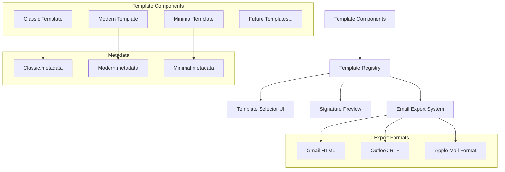
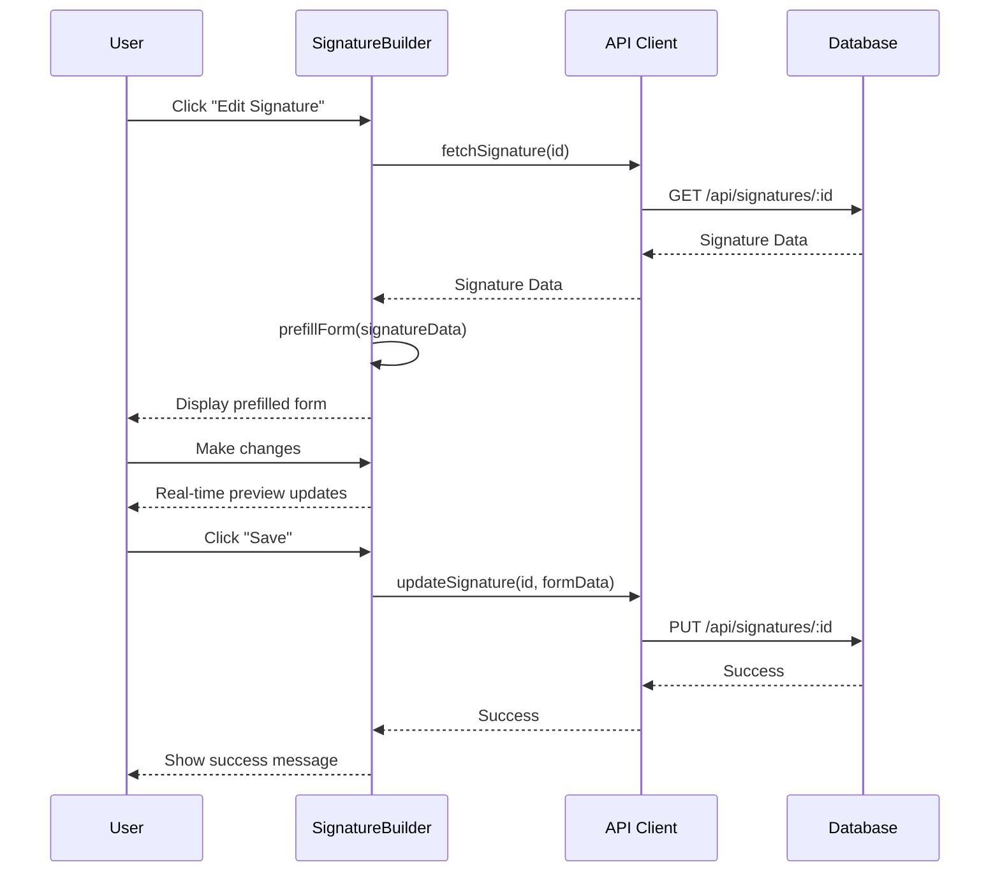
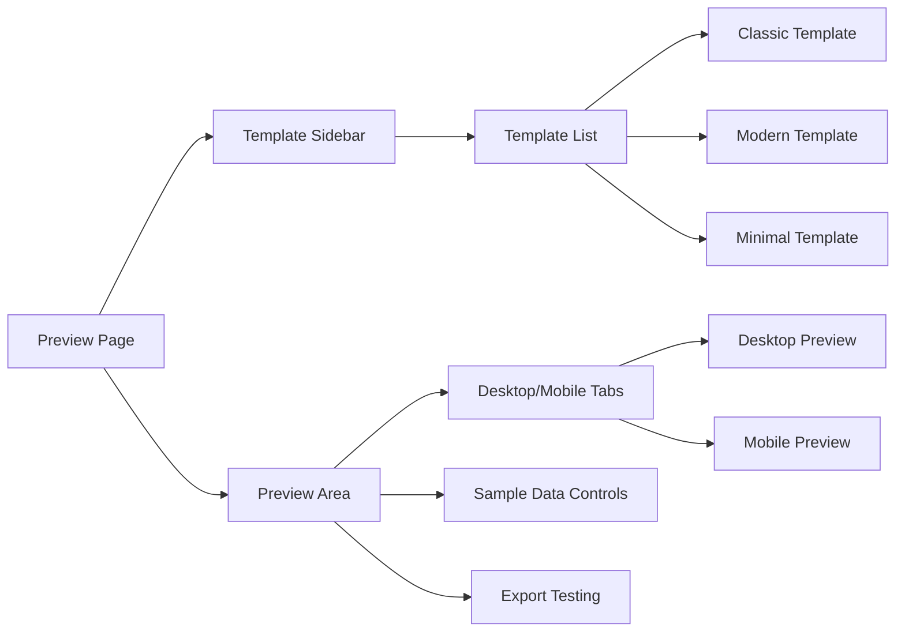

# Template System V1 Design Document

## Overview

This design document outlines the architecture for improving the SignatureCraft template system and preparing the application for v1 production deployment. The focus is on creating a maintainable, self-contained template architecture and ensuring robust email client compatibility.

## Architecture

### Template System Architecture



### Component Structure

#### Template Component Interface

```typescript
// src/components/signature/templates/types.ts
export interface TemplateProps {
  name: string;
  title?: string;
  company?: string;
  email: string;
  phone?: string;
  website?: string;
  logoData?: string;
  primaryColor?: string;
  secondaryColor?: string;
}

export interface TemplateMetadata {
  id: string;
  name: string;
  description: string;
  previewImage?: string;
}

export interface TemplateComponent {
  (props: TemplateProps): JSX.Element;
  metadata: TemplateMetadata;
}
```

#### Template Registry System

```typescript
// src/components/signature/templates/index.ts
import { Classic } from './classic';
import { Modern } from './modern';
import { Minimal } from './minimal';

export const TEMPLATES: Record<string, TemplateComponent> = {
  [Classic.metadata.id]: Classic,
  [Modern.metadata.id]: Modern,
  [Minimal.metadata.id]: Minimal,
};

export type TemplateId = keyof typeof TEMPLATES;
```

### Form Data Persistence Design

#### Edit Mode Data Flow



#### Form Prefill Utility

```typescript
// src/lib/form-utils.ts
import { SignatureData } from '@/types';
import { FormValues } from '@/components/signature/SignatureBuilder';

export function prefillFormValues(signatureData: SignatureData): FormValues {
  // Ensure all form fields are populated with data or defaults
  return {
    name: signatureData.name || '',
    title: signatureData.title || '',
    company: signatureData.company || '',
    email: signatureData.email || '',
    phone: signatureData.phone || '',
    website: signatureData.website || '',
    logoData: signatureData.logoData || '',
    templateId: signatureData.templateId || 'classic',
    primaryColor: signatureData.primaryColor || '#000000',
    secondaryColor: signatureData.secondaryColor || '#666666',
  };
}

export function detectFormChanges(
  original: SignatureData,
  current: FormValues
): Record<string, boolean> {
  // Track which fields have been modified
  const changes: Record<string, boolean> = {};
  
  Object.keys(current).forEach((key) => {
    const typedKey = key as keyof FormValues;
    if (original[typedKey] !== current[typedKey]) {
      changes[key] = true;
    }
  });
  
  return changes;
}
```

#### SignatureBuilder with Edit Mode

```typescript
// src/components/signature/SignatureBuilder.tsx
import { useEffect, useState } from 'react';
import { useRouter, useSearchParams } from 'next/navigation';
import { prefillFormValues } from '@/lib/form-utils';

export function SignatureBuilder() {
  const searchParams = useSearchParams();
  const router = useRouter();
  const signatureId = searchParams.get('id');
  const isEditMode = !!signatureId;
  
  const [isLoading, setIsLoading] = useState(isEditMode);
  const [formValues, setFormValues] = useState<FormValues>(defaultFormValues);
  
  // Fetch signature data if in edit mode
  useEffect(() => {
    if (isEditMode) {
      setIsLoading(true);
      
      fetchSignature(signatureId)
        .then((data) => {
          setFormValues(prefillFormValues(data));
        })
        .catch((error) => {
          toast.error('Failed to load signature data');
          console.error('Error loading signature:', error);
        })
        .finally(() => {
          setIsLoading(false);
        });
    }
  }, [signatureId, isEditMode]);
  
  const handleSubmit = async (values: FormValues) => {
    try {
      if (isEditMode) {
        await updateSignature(signatureId, values);
        toast.success('Signature updated successfully');
      } else {
        await createSignature(values);
        toast.success('Signature created successfully');
      }
      
      router.push('/dashboard');
    } catch (error) {
      toast.error(isEditMode ? 'Failed to update signature' : 'Failed to create signature');
      console.error('Error saving signature:', error);
    }
  };
  
  // Rest of component...
}
```

### Email Client Compatibility Design

#### Gmail Export Strategy

Gmail's signature editor accepts HTML but requires specific formatting:

```typescript
function generateGmailHtml(templateData: TemplateProps): string {
  // Use table-based layout with inline styles
  // Ensure images are base64 encoded
  // Use Gmail-compatible CSS properties
  return `
    <table cellpadding="0" cellspacing="0" border="0">
      <!-- Template-specific HTML with inline styles -->
    </table>
  `;
}
```

#### Outlook Export Strategy

Outlook requires rich text format that preserves formatting:

```typescript
function generateOutlookHtml(templateData: TemplateProps): string {
  // Use Outlook-compatible HTML structure
  // Include mso-specific CSS properties
  // Ensure proper table layouts for Outlook rendering
  return outlookCompatibleHtml;
}
```

#### Apple Mail Export Strategy

Apple Mail has specific requirements for signature import:

```typescript
function generateAppleMailHtml(templateData: TemplateProps): string {
  // Use Apple Mail compatible HTML structure
  // Consider providing .mailsignature file format
  // Ensure proper image handling for Apple Mail
  return appleMailCompatibleHtml;
}
```

## Template Development Environment

### Preview Page Architecture

The `/preview` page serves as a development environment for testing and refining email signature templates.



### Preview Page Layout

```typescript
// src/app/preview/page.tsx
function PreviewPage() {
  const [selectedTemplate, setSelectedTemplate] = useState<TemplateId>('classic');
  const [sampleData, setSampleData] = useState<TemplateProps>(defaultSampleData);
  
  return (
    <div className="flex h-screen">
      {/* Sidebar Navigation */}
      <aside className="w-64 bg-gray-50 border-r">
        <TemplateSidebar 
          selectedTemplate={selectedTemplate}
          onTemplateSelect={setSelectedTemplate}
        />
      </aside>
      
      {/* Main Preview Area */}
      <main className="flex-1 p-6">
        <TemplatePreviewArea 
          templateId={selectedTemplate}
          sampleData={sampleData}
          onSampleDataChange={setSampleData}
        />
      </main>
    </div>
  );
}
```

### Template Sidebar Component

```typescript
// src/components/preview/TemplateSidebar.tsx
import { TEMPLATES } from '@/components/signature/templates';

function TemplateSidebar({ selectedTemplate, onTemplateSelect }) {
  return (
    <div className="p-4">
      <h2 className="text-lg font-semibold mb-4">Templates</h2>
      <nav className="space-y-2">
        {Object.values(TEMPLATES).map((Template) => {
          const { id, name, description } = Template.metadata;
          
          return (
            <button
              key={id}
              onClick={() => onTemplateSelect(id)}
              className={`w-full text-left p-3 rounded-lg transition-colors ${
                selectedTemplate === id 
                  ? 'bg-blue-100 border-blue-300 border' 
                  : 'hover:bg-gray-100'
              }`}
            >
              <div className="font-medium">{name}</div>
              <div className="text-sm text-gray-600 mt-1">{description}</div>
              
              {/* Mini preview */}
              <div className="mt-2 p-2 bg-white rounded border scale-75 origin-top-left">
                <Template 
                  name="John Doe"
                  email="john@example.com"
                  company="Example Corp"
                />
              </div>
            </button>
          );
        })}
      </nav>
    </div>
  );
}
```

### Template Preview Area Component

```typescript
// src/components/preview/TemplatePreviewArea.tsx
function TemplatePreviewArea({ templateId, sampleData, onSampleDataChange }) {
  const Template = TEMPLATES[templateId];
  
  return (
    <div className="space-y-6">
      {/* Header */}
      <div>
        <h1 className="text-2xl font-bold">{Template.metadata.name} Template</h1>
        <p className="text-gray-600">{Template.metadata.description}</p>
      </div>
      
      {/* Sample Data Controls */}
      <Card>
        <CardHeader>
          <CardTitle>Sample Data</CardTitle>
        </CardHeader>
        <CardContent>
          <SampleDataForm 
            data={sampleData}
            onChange={onSampleDataChange}
          />
        </CardContent>
      </Card>
      
      {/* Preview Tabs */}
      <Card>
        <CardHeader>
          <CardTitle>Preview</CardTitle>
        </CardHeader>
        <CardContent>
          <Tabs defaultValue="desktop">
            <TabsList>
              <TabsTrigger value="desktop">Desktop View</TabsTrigger>
              <TabsTrigger value="mobile">Mobile View</TabsTrigger>
            </TabsList>
            
            <TabsContent value="desktop" className="mt-4">
              <div className="border rounded-lg p-6 bg-white">
                <Template {...sampleData} />
              </div>
            </TabsContent>
            
            <TabsContent value="mobile" className="mt-4">
              <div className="border rounded-lg p-4 bg-white max-w-sm">
                <Template {...sampleData} />
              </div>
            </TabsContent>
          </Tabs>
        </CardContent>
      </Card>
      
      {/* Export Testing */}
      <Card>
        <CardHeader>
          <CardTitle>Export Testing</CardTitle>
        </CardHeader>
        <CardContent>
          <div className="flex gap-2">
            <Button onClick={() => testGmailExport(sampleData)}>
              Test Gmail Export
            </Button>
            <Button onClick={() => testOutlookExport(sampleData)}>
              Test Outlook Export
            </Button>
            <Button onClick={() => testAppleMailExport(sampleData)}>
              Test Apple Mail Export
            </Button>
          </div>
        </CardContent>
      </Card>
    </div>
  );
}
```

### Sample Data Form Component

```typescript
// src/components/preview/SampleDataForm.tsx
function SampleDataForm({ data, onChange }) {
  const updateField = (field: keyof TemplateProps, value: string) => {
    onChange({ ...data, [field]: value });
  };
  
  return (
    <div className="grid grid-cols-2 gap-4">
      <div>
        <Label htmlFor="name">Name</Label>
        <Input
          id="name"
          value={data.name}
          onChange={(e) => updateField('name', e.target.value)}
        />
      </div>
      
      <div>
        <Label htmlFor="title">Title</Label>
        <Input
          id="title"
          value={data.title || ''}
          onChange={(e) => updateField('title', e.target.value)}
        />
      </div>
      
      <div>
        <Label htmlFor="company">Company</Label>
        <Input
          id="company"
          value={data.company || ''}
          onChange={(e) => updateField('company', e.target.value)}
        />
      </div>
      
      <div>
        <Label htmlFor="email">Email</Label>
        <Input
          id="email"
          type="email"
          value={data.email}
          onChange={(e) => updateField('email', e.target.value)}
        />
      </div>
      
      <div>
        <Label htmlFor="phone">Phone</Label>
        <Input
          id="phone"
          value={data.phone || ''}
          onChange={(e) => updateField('phone', e.target.value)}
        />
      </div>
      
      <div>
        <Label htmlFor="website">Website</Label>
        <Input
          id="website"
          value={data.website || ''}
          onChange={(e) => updateField('website', e.target.value)}
        />
      </div>
      
      <div>
        <Label htmlFor="primaryColor">Primary Color</Label>
        <Input
          id="primaryColor"
          type="color"
          value={data.primaryColor || '#000000'}
          onChange={(e) => updateField('primaryColor', e.target.value)}
        />
      </div>
      
      <div>
        <Label htmlFor="secondaryColor">Secondary Color</Label>
        <Input
          id="secondaryColor"
          type="color"
          value={data.secondaryColor || '#666666'}
          onChange={(e) => updateField('secondaryColor', e.target.value)}
        />
      </div>
    </div>
  );
}
```

## Components and Interfaces

### Updated Template Selector

```typescript
// src/components/signature/TemplateSelector.tsx
import { TEMPLATES } from './templates';

function TemplateSelector({ selectedTemplate, onTemplateChange }) {
  return (
    <div className="template-grid">
      {Object.values(TEMPLATES).map((Template) => {
        const { id, name, description } = Template.metadata;
        
        return (
          <Card 
            key={id}
            className={selectedTemplate === id ? 'selected' : ''}
            onClick={() => onTemplateChange(id)}
          >
            <CardHeader>
              <CardTitle>{name}</CardTitle>
              <CardDescription>{description}</CardDescription>
            </CardHeader>
            <CardContent>
              <div className="template-preview">
                <Template {...previewData} />
              </div>
            </CardContent>
          </Card>
        );
      })}
    </div>
  );
}
```

### Enhanced Signature Preview

```typescript
// src/components/signature/SignaturePreview.tsx
import { TEMPLATES } from './templates';

function SignaturePreview({ data, onSave, isSaving }) {
  const Template = TEMPLATES[data.templateId || 'classic'];
  
  return (
    <div className="preview-container">
      <Tabs defaultValue="desktop">
        <TabsList>
          <TabsTrigger value="desktop">Desktop</TabsTrigger>
          <TabsTrigger value="mobile">Mobile</TabsTrigger>
        </TabsList>
        
        <TabsContent value="desktop">
          <div className="desktop-preview">
            <Template {...data} />
          </div>
        </TabsContent>
        
        <TabsContent value="mobile">
          <div className="mobile-preview">
            <Template {...data} />
          </div>
        </TabsContent>
      </Tabs>
      
      <div className="export-buttons">
        <Button onClick={() => copyForGmail(data)}>
          Copy for Gmail
        </Button>
        <Button onClick={() => copyForOutlook(data)}>
          Copy for Outlook
        </Button>
        <Button onClick={() => copyForAppleMail(data)}>
          Copy for Apple Mail
        </Button>
      </div>
    </div>
  );
}
```

## Data Models

### Template Data Structure

```typescript
interface SignatureData extends TemplateProps {
  id?: string;
  userId: string;
  templateId: TemplateId;
  createdAt?: Date;
  updatedAt?: Date;
}
```

## Error Handling Strategy

### Template Loading Errors

```typescript
function loadTemplate(templateId: string): TemplateComponent {
  const template = TEMPLATES[templateId];
  
  if (!template) {
    console.error(`Template not found: ${templateId}`);
    return TEMPLATES['classic']; // Fallback to classic
  }
  
  if (!template.metadata) {
    console.error(`Template metadata missing: ${templateId}`);
    throw new Error('Invalid template configuration');
  }
  
  return template;
}
```

### Email Export Error Handling

```typescript
async function copyToClipboard(html: string, format: 'gmail' | 'outlook' | 'apple'): Promise<void> {
  try {
    await navigator.clipboard.writeText(html);
    toast.success(`Copied for ${format}!`);
  } catch (error) {
    console.error('Clipboard copy failed:', error);
    toast.error('Copy failed. Please try again.');
    
    // Fallback: Show modal with HTML to copy manually
    showManualCopyModal(html);
  }
}
```

## Testing Strategy

### Template Component Testing

```typescript
// Test each template component
describe('Template Components', () => {
  test('Classic template renders with all props', () => {
    const props = { name: 'Test', email: 'test@example.com' };
    render(<Classic {...props} />);
    expect(screen.getByText('Test')).toBeInTheDocument();
  });
  
  test('Template metadata is properly defined', () => {
    expect(Classic.metadata.id).toBe('classic');
    expect(Classic.metadata.name).toBeTruthy();
    expect(Classic.metadata.description).toBeTruthy();
  });
});
```

### Email Client Compatibility Testing

```typescript
// Test HTML generation for each email client
describe('Email Export', () => {
  test('Gmail HTML is properly formatted', () => {
    const html = generateGmailHtml(testData);
    expect(html).toContain('<table');
    expect(html).not.toContain('<style>'); // Should use inline styles
  });
  
  test('Outlook HTML includes mso properties', () => {
    const html = generateOutlookHtml(testData);
    expect(html).toContain('mso-');
  });
});
```

## Performance Optimization

### Template Loading Performance

- Lazy load template components when needed
- Cache template registry to avoid repeated imports
- Optimize template rendering with React.memo where appropriate

### Image Processing Performance

- Maintain current Canvas API approach for client-side processing
- Ensure image resizing is efficient and doesn't block UI
- Add loading states for image processing operations

## Deployment Considerations

### Environment Configuration

```typescript
// Production environment variables
const config = {
  DATABASE_URL: process.env.DATABASE_URL,
  BETTER_AUTH_SECRET: process.env.BETTER_AUTH_SECRET,
  BETTER_AUTH_URL: process.env.BETTER_AUTH_URL,
  NODE_ENV: 'production',
};
```

### Monitoring and Logging

```typescript
// Error tracking and performance monitoring
import { captureException, addBreadcrumb } from '@sentry/nextjs';

function trackTemplateError(templateId: string, error: Error) {
  addBreadcrumb({
    message: `Template error: ${templateId}`,
    level: 'error',
  });
  captureException(error);
}
```

### Database Performance

- Ensure proper indexing on signatures table
- Monitor query performance in production
- Implement connection pooling optimization

## Security Considerations

### Input Validation

```typescript
// Validate template data before processing
const templateDataSchema = z.object({
  name: z.string().min(1).max(100),
  email: z.string().email(),
  templateId: z.enum(['classic', 'modern', 'minimal']),
  // ... other fields
});
```

### XSS Prevention

- Sanitize all user input before rendering
- Use proper escaping in template HTML generation
- Validate base64 image data before processing